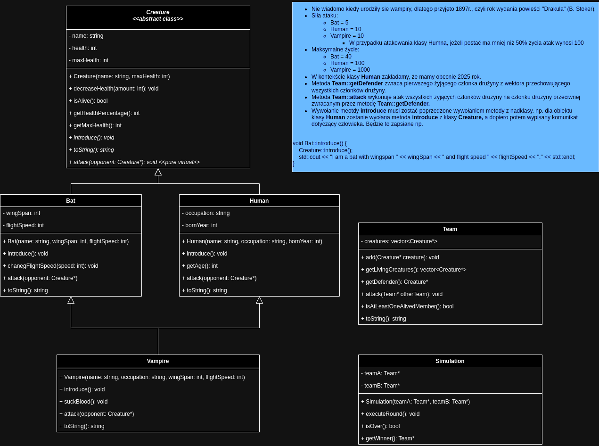

[](https://classroom.github.com/open-in-codespaces?assignment_repo_id=20258660)
## Zadanie: Implementacja "Potwory"

## Cel zadania

Zaimplementuj klasy zgodzie z diagramem klas



Testy jednostkowe, które sprawdzają poprawność implementacji sugerują kolejność implementacji klas.
Są to następujące testy:

```bash 
make test_creature
make test_bat
make test_human
make test_vampire
make test_team
make test_simulation
```